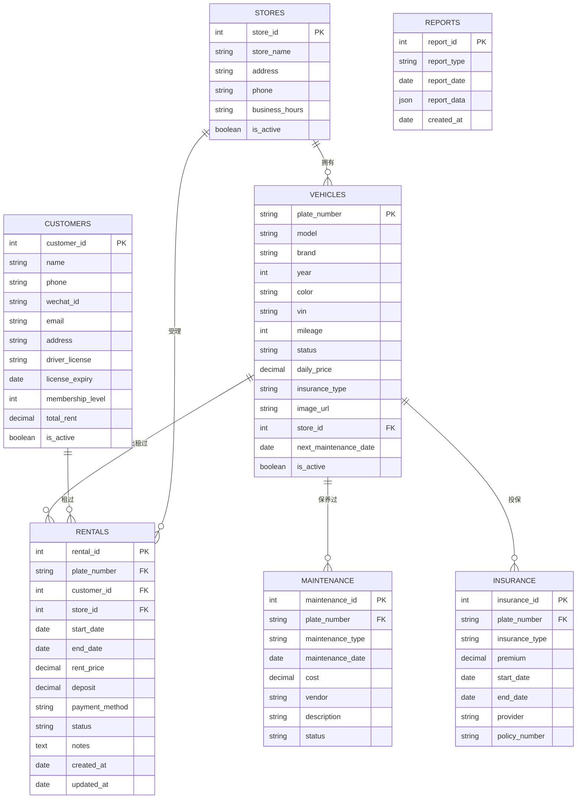

# CarGo LA 租车管理系统 - ER图

## 数据库设计

---

## 表结构详细说明

### 1. STORES (门店表)
| 字段 | 类型 | 说明 |
|------|------|------|
| store_id | INT | 主键，自增 |
| store_name | VARCHAR(100) | 门店名称 |
| address | VARCHAR(255) | 地址 |
| phone | VARCHAR(20) | 电话 |
| business_hours | VARCHAR(100) | 营业时间 |
| is_active | BOOLEAN | 是否营业 |

### 2. VEHICLES (车辆表)
| 字段 | 类型 | 说明 |
|------|------|------|
| plate_number | VARCHAR(20) | 主键，车牌号 |
| model | VARCHAR(50) | 车型 |
| brand | VARCHAR(50) | 品牌 |
| year | INT | 年份 |
| color | VARCHAR(20) | 颜色 |
| vin | VARCHAR(50) | 车架号 |
| mileage | INT | 里程数 |
| status | ENUM | 可用/已租/维修中/报废 |
| daily_price | DECIMAL | 日租金 |
| insurance_type | VARCHAR(50) | 保险类型 |
| image_url | VARCHAR(255) | 图片链接 |
| store_id | INT | 所属门店 |
| next_maintenance_date | DATE | 下次保养日期 |
| is_active | BOOLEAN | 是否在用 |

### 3. CUSTOMERS (客户表)
| 字段 | 类型 | 说明 |
|------|------|------|
| customer_id | INT | 主键，自增 |
| name | VARCHAR(100) | 姓名 |
| phone | VARCHAR(20) | 电话 |
| wechat_id | VARCHAR(100) | 微信号 |
| email | VARCHAR(100) | 邮箱 |
| address | VARCHAR(255) | 地址 |
| driver_license | VARCHAR(50) | 驾驶证号 |
| license_expiry | DATE | 驾照有效期 |
| membership_level | INT | 会员等级 |
| total_rent | DECIMAL | 累计消费 |
| is_active | BOOLEAN | 是否有效 |

### 4. RENTALS (租赁记录表)
| 字段 | 类型 | 说明 |
|------|------|------|
| rental_id | INT | 主键，自增 |
| plate_number | VARCHAR(20) | 外键，车牌号 |
| customer_id | INT | 外键，客户ID |
| store_id | INT | 外键，门店ID |
| start_date | DATE | 开始日期 |
| end_date | DATE | 结束日期 |
| rent_price | DECIMAL | 租金 |
| deposit | DECIMAL | 押金 |
| payment_method | VARCHAR(50) | 支付方式 |
| status | ENUM | 预订/进行中/已完成/已取消 |
| notes | TEXT | 备注 |
| created_at | DATETIME | 创建时间 |
| updated_at | DATETIME | 更新时间 |

### 5. MAINTENANCE (维修保养表)
| 字段 | 类型 | 说明 |
|------|------|------|
| maintenance_id | INT | 主键，自增 |
| plate_number | VARCHAR(20) | 外键，车牌号 |
| maintenance_type | VARCHAR(50) | 保养类型 |
| maintenance_date | DATE | 保养日期 |
| cost | DECIMAL | 费用 |
| vendor | VARCHAR(100) | 维修商 |
| description | VARCHAR(255) | 描述 |
| status | ENUM | 计划中/进行中/已完成 |

### 6. INSURANCE (保险表)
| 字段 | 类型 | 说明 |
|------|------|------|
| insurance_id | INT | 主键，自增 |
| plate_number | VARCHAR(20) | 外键，车牌号 |
| insurance_type | VARCHAR(50) | 保险类型 |
| premium | DECIMAL | 保费 |
| start_date | DATE | 生效日期 |
| end_date | DATE | 过期日期 |
| provider | VARCHAR(100) | 保险公司 |
| policy_number | VARCHAR(50) | 保单号 |

---

## 状态枚举

### 车辆状态 (VEHICLES.status)
- AVAILABLE - 可用
- RENTED - 已租
- MAINTENANCE - 维修中
- RETIRED - 报废

### 租赁状态 (RENTALS.status)
- PENDING - 待确认
- CONFIRMED - 已确认
- IN_PROGRESS - 进行中
- COMPLETED - 已完成
- CANCELLED - 已取消

### 维修状态 (MAINTENANCE.status)
- PLANNED - 计划中
- IN_PROGRESS - 进行中
- COMPLETED - 已完成
